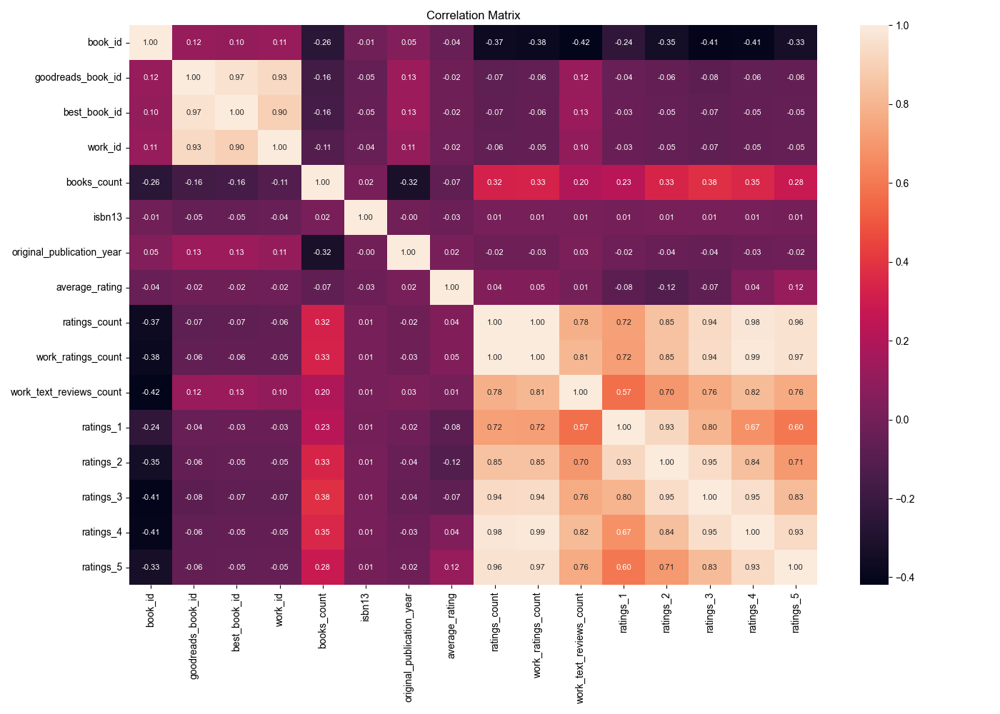

# Automated Analysis
## Summary Statistics
|        |   book_id |   goodreads_book_id |     best_book_id |         work_id |   books_count |         isbn |         isbn13 | authors      |   original_publication_year | original_title   | title          | language_code   |   average_rating |    ratings_count |   work_ratings_count |   work_text_reviews_count |   ratings_1 |   ratings_2 |   ratings_3 |      ratings_4 |       ratings_5 | image_url                                                                                | small_image_url                                                                        |
|:-------|----------:|--------------------:|-----------------:|----------------:|--------------:|-------------:|---------------:|:-------------|----------------------------:|:-----------------|:---------------|:----------------|-----------------:|-----------------:|---------------------:|--------------------------:|------------:|------------:|------------:|---------------:|----------------:|:-----------------------------------------------------------------------------------------|:---------------------------------------------------------------------------------------|
| count  |  10000    |     10000           |  10000           | 10000           |    10000      | 9300         | 9415           | 10000        |                    9979     | 9415             | 10000          | 8916            |     10000        |  10000           |      10000           |                  10000    |    10000    |    10000    |     10000   | 10000          | 10000           | 10000                                                                                    | 10000                                                                                  |
| unique |    nan    |       nan           |    nan           |   nan           |      nan      | 9300         |  nan           | 4664         |                     nan     | 9274             | 9964           | 25              |       nan        |    nan           |        nan           |                    nan    |      nan    |      nan    |       nan   |   nan          |   nan           | 6669                                                                                     | 6669                                                                                   |
| top    |    nan    |       nan           |    nan           |   nan           |      nan      |    3.757e+08 |  nan           | Stephen King |                     nan     |                  | Selected Poems | eng             |       nan        |    nan           |        nan           |                    nan    |      nan    |      nan    |       nan   |   nan          |   nan           | https://s.gr-assets.com/assets/nophoto/book/111x148-bcc042a9c91a29c1d680899eff700a03.png | https://s.gr-assets.com/assets/nophoto/book/50x75-a91bf249278a81aabab721ef782c4a74.png |
| freq   |    nan    |       nan           |    nan           |   nan           |      nan      |    1         |  nan           | 60           |                     nan     | 5                | 4              | 6341            |       nan        |    nan           |        nan           |                    nan    |      nan    |      nan    |       nan   |   nan          |   nan           | 3332                                                                                     | 3332                                                                                   |
| mean   |   5000.5  |         5.2647e+06  |      5.47121e+06 |     8.64618e+06 |       75.7127 |  nan         |    9.75504e+12 | nan          |                    1981.99  | nan              | nan            | nan             |         4.00219  |  54001.2         |      59687.3         |                   2919.96 |     1345.04 |     3110.89 |     11475.9 | 19965.7        | 23789.8         | nan                                                                                      | nan                                                                                    |
| std    |   2886.9  |         7.57546e+06 |      7.82733e+06 |     1.17511e+07 |      170.471  |  nan         |    4.42862e+11 | nan          |                     152.577 | nan              | nan            | nan             |         0.254427 | 157370           |     167804           |                   6124.38 |     6635.63 |     9717.12 |     28546.4 | 51447.4        | 79768.9         | nan                                                                                      | nan                                                                                    |
| min    |      1    |         1           |      1           |    87           |        1      |  nan         |    1.9517e+08  | nan          |                   -1750     | nan              | nan            | nan             |         2.47     |   2716           |       5510           |                      3    |       11    |       30    |       323   |   750          |   754           | nan                                                                                      | nan                                                                                    |
| 25%    |   2500.75 |     46275.8         |  47911.8         |     1.00884e+06 |       23      |  nan         |    9.78032e+12 | nan          |                    1990     | nan              | nan            | nan             |         3.85     |  13568.8         |      15438.8         |                    694    |      196    |      656    |      3112   |  5405.75       |  5334           | nan                                                                                      | nan                                                                                    |
| 50%    |   5000.5  |    394966           | 425124           |     2.71952e+06 |       40      |  nan         |    9.78045e+12 | nan          |                    2004     | nan              | nan            | nan             |         4.02     |  21155.5         |      23832.5         |                   1402    |      391    |     1163    |      4894   |  8269.5        |  8836           | nan                                                                                      | nan                                                                                    |
| 75%    |   7500.25 |         9.38223e+06 |      9.63611e+06 |     1.45177e+07 |       67      |  nan         |    9.78083e+12 | nan          |                    2011     | nan              | nan            | nan             |         4.18     |  41053.5         |      45915           |                   2744.25 |      885    |     2353.25 |      9287   | 16023.5        | 17304.5         | nan                                                                                      | nan                                                                                    |
| max    |  10000    |         3.32886e+07 |      3.55342e+07 |     5.63996e+07 |     3455      |  nan         |    9.79001e+12 | nan          |                    2017     | nan              | nan            | nan             |         4.82     |      4.78065e+06 |          4.94236e+06 |                 155254    |   456191    |   436802    |    793319   |     1.4813e+06 |     3.01154e+06 | nan                                                                                      | nan                                                                                    |
## Missing Values
|                           |    0 |
|:--------------------------|-----:|
| book_id                   |    0 |
| goodreads_book_id         |    0 |
| best_book_id              |    0 |
| work_id                   |    0 |
| books_count               |    0 |
| isbn                      |  700 |
| isbn13                    |  585 |
| authors                   |    0 |
| original_publication_year |   21 |
| original_title            |  585 |
| title                     |    0 |
| language_code             | 1084 |
| average_rating            |    0 |
| ratings_count             |    0 |
| work_ratings_count        |    0 |
| work_text_reviews_count   |    0 |
| ratings_1                 |    0 |
| ratings_2                 |    0 |
| ratings_3                 |    0 |
| ratings_4                 |    0 |
| ratings_5                 |    0 |
| image_url                 |    0 |
| small_image_url           |    0 |
## Correlation Matrix

## Analysis Story
### Story of the Book Dataset Analysis

In the vast landscape of literature, data can offer profound insights into the preferences and behaviors of readers. This analysis delves into a dataset comprising 10,000 unique books, revealing a wealth of information through summary statistics, missing values, and correlation matrices. Here, we unearth significant insights that not only highlight the features of the dataset but also raise intriguing questions about reader engagement and book popularity.

#### Summary Statistics: A Glimpse into the Dataset

The dataset contains 10,000 entries, with a notable diversity in the `small_image_url` field, featuring 6,669 unique images. This suggests a rich variety of titles, likely spanning multiple genres and authors. The `book_id` values range from 1 to 10,000, indicating a well-structured dataset, while the mean suggests a balanced distribution of books.

However, the presence of missing values in key columns raises some flags. Notably, the `isbn` and `isbn13` fields have 700 and 585 missing entries, respectively, which could hinder the ability to uniquely identify some books. Additionally, the `original_publication_year` has 21 missing entries, which could affect historical analysis of publication trends. The `language_code` field shows a significant 1,084 missing values, hinting that a considerable portion of the collection may not be in English, thus opening avenues for exploring international literature.

#### Correlation Insights: Understanding Reader Engagement

The correlation matrix reveals interconnected relationships between various attributes. One standout finding is the strong positive correlation between `ratings_count`, `work_ratings_count`, and the individual ratings (from `ratings_1` to `ratings_5`). This suggests that books with a higher number of ratings tend to receive better overall ratings—a probable reflection of reader engagement. 

Interestingly, the negative correlation between the number of books (`books_count`) and ratings reflects a potential trend: as the number of books increases, the individual ratings tend to decrease. This could imply that readers may be overwhelmed by choice, leading to lower satisfaction with individual titles.

#### The Impact of Ratings

The analysis shows that the distribution of ratings is crucial for understanding reader preferences. The correlation coefficients between the different ratings are all above 0.7, indicating that books rated highly in one category (e.g., 5-star ratings) also tend to perform well in others (e.g., 4-star ratings). This consistency suggests that readers are likely to have similar experiences across different ratings for a particular book, reinforcing the idea of a "good read."

#### Missing Values: A Call to Action

The missing values in crucial fields like `isbn`, `original_title`, and `language_code` present a challenge but also an opportunity. Addressing these gaps could enhance the dataset's completeness and usability. For instance, filling in the missing `isbn` values would allow for more efficient cross-referencing with other databases, enriching the analysis with additional metadata.

#### Conclusion: A Data-Driven Narrative

In conclusion, this analysis of the book dataset paints a vivid picture of reader preferences and behaviors. The insights gleaned from the summary statistics and correlation analysis not only illuminate patterns in book ratings and engagement but also underscore the importance of addressing missing data to enhance future analyses. 

As we move forward, the journey into the world of books and readers continues, driven by data that unravels the complexities of literary consumption. This dataset, with its rich insights and potential for deeper exploration, invites further research into the ever-evolving relationship between literature and its audience. Whether one is a data scientist, a publisher, or a passionate reader, the story told by this dataset is just beginning to unfold.