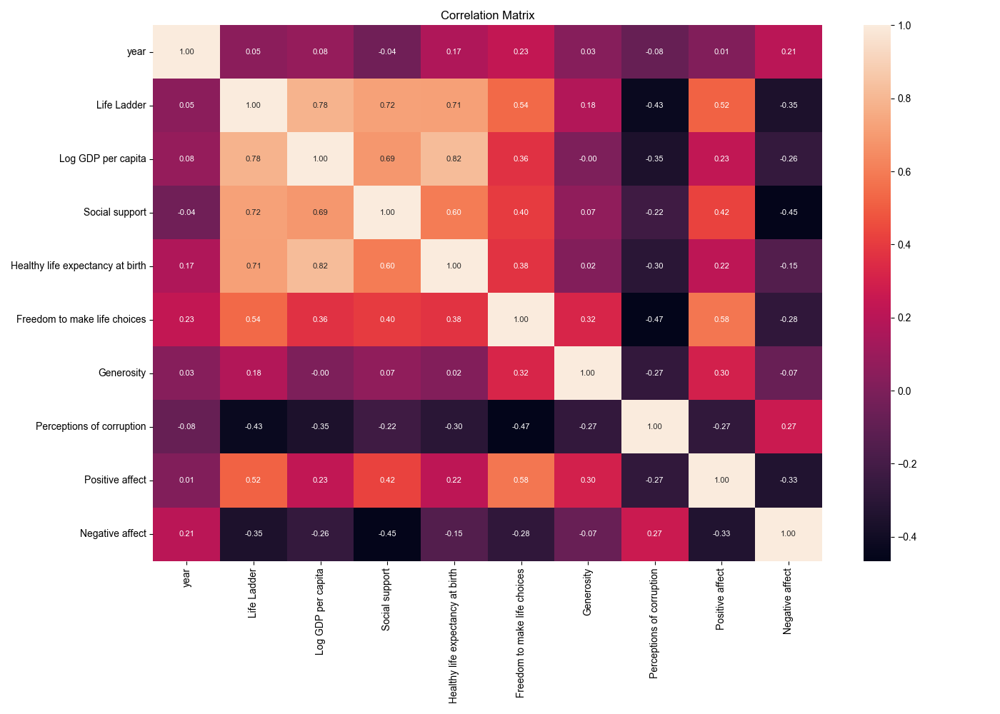

# Automated Analysis
## Summary Statistics
|        | Country name   |       year |   Life Ladder |   Log GDP per capita |   Social support |   Healthy life expectancy at birth |   Freedom to make life choices |     Generosity |   Perceptions of corruption |   Positive affect |   Negative affect |
|:-------|:---------------|-----------:|--------------:|---------------------:|-----------------:|-----------------------------------:|-------------------------------:|---------------:|----------------------------:|------------------:|------------------:|
| count  | 2363           | 2363       |    2363       |           2335       |      2350        |                         2300       |                    2327        | 2282           |                 2238        |       2339        |      2347         |
| unique | 165            |  nan       |     nan       |            nan       |       nan        |                          nan       |                     nan        |  nan           |                  nan        |        nan        |       nan         |
| top    | Argentina      |  nan       |     nan       |            nan       |       nan        |                          nan       |                     nan        |  nan           |                  nan        |        nan        |       nan         |
| freq   | 18             |  nan       |     nan       |            nan       |       nan        |                          nan       |                     nan        |  nan           |                  nan        |        nan        |       nan         |
| mean   | nan            | 2014.76    |       5.48357 |              9.39967 |         0.809369 |                           63.4018  |                       0.750282 |    9.77213e-05 |                    0.743971 |          0.651882 |         0.273151  |
| std    | nan            |    5.05944 |       1.12552 |              1.15207 |         0.121212 |                            6.84264 |                       0.139357 |    0.161388    |                    0.184865 |          0.10624  |         0.0871311 |
| min    | nan            | 2005       |       1.281   |              5.527   |         0.228    |                            6.72    |                       0.228    |   -0.34        |                    0.035    |          0.179    |         0.083     |
| 25%    | nan            | 2011       |       4.647   |              8.5065  |         0.744    |                           59.195   |                       0.661    |   -0.112       |                    0.687    |          0.572    |         0.209     |
| 50%    | nan            | 2015       |       5.449   |              9.503   |         0.8345   |                           65.1     |                       0.771    |   -0.022       |                    0.7985   |          0.663    |         0.262     |
| 75%    | nan            | 2019       |       6.3235  |             10.3925  |         0.904    |                           68.5525  |                       0.862    |    0.09375     |                    0.86775  |          0.737    |         0.326     |
| max    | nan            | 2023       |       8.019   |             11.676   |         0.987    |                           74.6     |                       0.985    |    0.7         |                    0.983    |          0.884    |         0.705     |
## Missing Values
|                                  |   0 |
|:---------------------------------|----:|
| Country name                     |   0 |
| year                             |   0 |
| Life Ladder                      |   0 |
| Log GDP per capita               |  28 |
| Social support                   |  13 |
| Healthy life expectancy at birth |  63 |
| Freedom to make life choices     |  36 |
| Generosity                       |  81 |
| Perceptions of corruption        | 125 |
| Positive affect                  |  24 |
| Negative affect                  |  16 |
## Correlation Matrix

## Analysis Story
### Key Insights from the Dataset Analysis

The dataset presents a rich set of statistics related to various factors influencing subjective well-being across different countries over time, specifically from 2005 to 2023. The analysis reveals several interesting trends and correlations that can shed light on the dynamics of happiness and quality of life globally.

#### Summary of Key Variables

1. **Life Ladder**: The average "Life Ladder" score is approximately 5.48, indicating a moderate level of life satisfaction among respondents. The scores range from a minimum of 1.28 to a maximum of 8.02, suggesting significant variability in life satisfaction across different countries and years.

2. **Log GDP per Capita**: This is a strong predictor of life satisfaction, with a high mean correlation (0.78) with the Life Ladder. This suggests that wealthier nations tend to have higher levels of reported happiness. However, there are countries with high GDP that do not score as high on the Life Ladder, indicating other factors at play.

3. **Social Support**: The correlation with Life Ladder (0.72) indicates that the feeling of being supported by others significantly contributes to happiness. The social fabric within countries can greatly influence individual perceptions of well-being.

4. **Healthy Life Expectancy**: This variable also correlates positively with Life Ladder (0.71), suggesting that health is a critical component of happiness. Countries that invest in healthcare and promote healthy living likely see higher life satisfaction among their populations.

5. **Freedom to Make Life Choices**: This variable has a strong correlation (0.54) with Life Ladder, indicating that individuals' perceptions of their freedom directly impact their happiness. Societies that empower their citizens to make personal choices tend to report higher satisfaction levels.

6. **Corruption**: Interestingly, "Perceptions of Corruption" shows a negative correlation with Life Ladder (-0.43). Citizens in countries perceived to be more corrupt report lower levels of happiness, highlighting the importance of governance and trust in public institutions.

7. **Emotional Well-Being**: The dataset includes measures of positive and negative affect, which provide insights into the emotional components of life satisfaction. Positive affect is positively correlated with Life Ladder (0.51), while negative affect has a negative correlation (-0.35). This indicates that emotional experiences significantly shape overall life satisfaction.

#### Missing Values and Their Implications

The dataset exhibits some missing values in key variables such as "Log GDP per capita," "Social support," and "Generosity." This could lead to biased estimates if not handled properly. The substantial number of missing data points for "Generosity" (81) suggests that further investigation into the reasons for these missing values could yield insights into cultural or reporting biases.

#### Story of Global Well-Being

As we analyze global happiness, it becomes clear that while economic prosperity (measured by GDP) plays a crucial role in life satisfaction, it is far from the only factor. The findings emphasize the importance of social support, health, and personal freedom, suggesting a holistic approach to enhancing well-being.

Countries that prioritize the well-being of their citizens—through fostering social networks, ensuring healthcare access, and promoting personal freedoms—tend to fare better on happiness indices. Conversely, high levels of corruption can diminish happiness, underscoring the necessity for transparency and trust in governance.

In summary, the narrative of global well-being is multifaceted. While wealth contributes to happiness, the quality of social connections, health, and freedom to make choices are equally, if not more, important. Policymakers and leaders aiming to improve happiness should focus on these interconnected factors to create environments where citizens can thrive and experience higher life satisfaction.