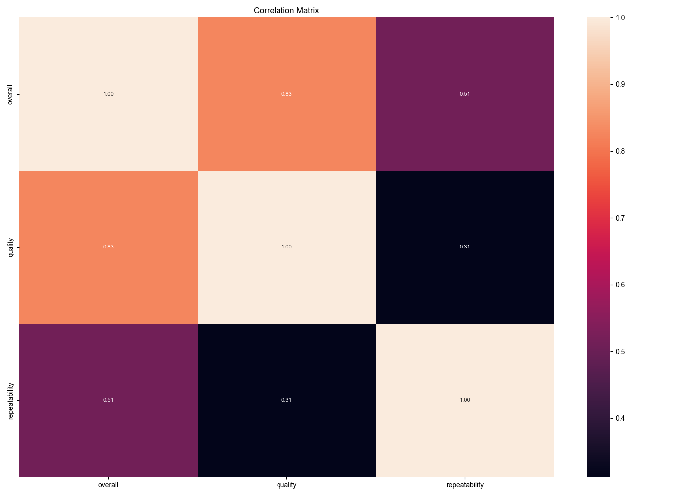

# Automated Analysis
## Summary Statistics
|        | date      | language   | type   | title             | by                |    overall |     quality |   repeatability |
|:-------|:----------|:-----------|:-------|:------------------|:------------------|-----------:|------------:|----------------:|
| count  | 2553      | 2652       | 2652   | 2652              | 2390              | 2652       | 2652        |     2652        |
| unique | 2055      | 11         | 8      | 2312              | 1528              |  nan       |  nan        |      nan        |
| top    | 21-May-06 | English    | movie  | Kanda Naal Mudhal | Kiefer Sutherland |  nan       |  nan        |      nan        |
| freq   | 8         | 1306       | 2211   | 9                 | 48                |  nan       |  nan        |      nan        |
| mean   | nan       | nan        | nan    | nan               | nan               |    3.04751 |    3.20928  |        1.49472  |
| std    | nan       | nan        | nan    | nan               | nan               |    0.76218 |    0.796743 |        0.598289 |
| min    | nan       | nan        | nan    | nan               | nan               |    1       |    1        |        1        |
| 25%    | nan       | nan        | nan    | nan               | nan               |    3       |    3        |        1        |
| 50%    | nan       | nan        | nan    | nan               | nan               |    3       |    3        |        1        |
| 75%    | nan       | nan        | nan    | nan               | nan               |    3       |    4        |        2        |
| max    | nan       | nan        | nan    | nan               | nan               |    5       |    5        |        3        |
## Missing Values
|               |   0 |
|:--------------|----:|
| date          |  99 |
| language      |   0 |
| type          |   0 |
| title         |   0 |
| by            | 262 |
| overall       |   0 |
| quality       |   0 |
| repeatability |   0 |
## Correlation Matrix

## Analysis Story
### Dataset Analysis Story

**Overview:**
The dataset comprises 2,652 records, detailing various attributes of items (likely movies or shows) including their release date, language, type, title, creator, and ratings across three dimensions: overall, quality, and repeatability. The dataset has a significant amount of missing data, particularly for the 'date' and 'by' attributes, which may impact the analysis.

**Key Insights:**

1. **Temporal Coverage and Missing Data:**
   - The dataset spans a range of dates, with the most frequent date being May 21, 2006. However, there are 99 missing entries in the 'date' column, which could limit insights regarding trends over time. The absence of data on the creators ('by') for 262 records also suggests potential gaps in analyzing the impact of individual creators on ratings.

2. **Language Distribution:**
   - The dataset contains records from 11 different languages, with the most common being English (1,306 instances). This indicates that the dataset may have a strong bias towards English-language content, which could skew the overall findings and insights when comparing across different languages.

3. **Types of Content:**
   - The dataset categorizes items into 8 different types, with 'movie' being the most prevalent (2,211 occurrences). This dominance of one type suggests that the analysis might be more reflective of movie ratings than other types, such as series or documentaries.

4. **Rating Analysis:**
   - The ratings for 'overall' (mean: 3.05), 'quality' (mean: 3.21), and 'repeatability' (mean: 1.49) reflect a generally moderate satisfaction among viewers. 
   - The standard deviations for 'overall' and 'quality' ratings indicate a moderate level of disagreement among ratings, suggesting some items are rated highly while others are not, which may be indicative of polarized opinions.

5. **Correlation Insights:**
   - The correlation matrix reveals a strong positive correlation (0.83) between 'overall' and 'quality' ratings, suggesting that items perceived as higher quality tend to receive better overall ratings. The correlation between 'overall' and 'repeatability' (0.51) is moderate, implying that while quality impacts overall satisfaction, repeatability may be a less significant factor. The weakest correlation is between 'quality' and 'repeatability' (0.31), indicating that an item may be rated highly in quality but might not necessarily be considered worth revisiting.

6. **Statistical Distribution:**
   - The overall ratings are clustered around the middle range, with 75% of ratings being between 3 and 4. This highlights a tendency for items to be rated just above average. Additionally, the maximum rating for 'repeatability' is capped at 3, suggesting that while items may be enjoyable, the likelihood of viewers rewatching them is relatively low.

**Conclusion:**
This analysis of the dataset reveals several critical insights about viewer preferences and behaviors towards various items. The strong relationship between quality and overall ratings suggests that improving perceived quality could lead to higher overall satisfaction. However, the low repeatability ratings indicate that while viewers may appreciate the content on first viewing, it may not have lasting appeal. The missing values in the dataset point to potential areas for further investigation, particularly in understanding the creators' impacts and temporal trends in viewer ratings. Future analyses could benefit from addressing these gaps and exploring viewer sentiment across different languages and types of content more comprehensively.